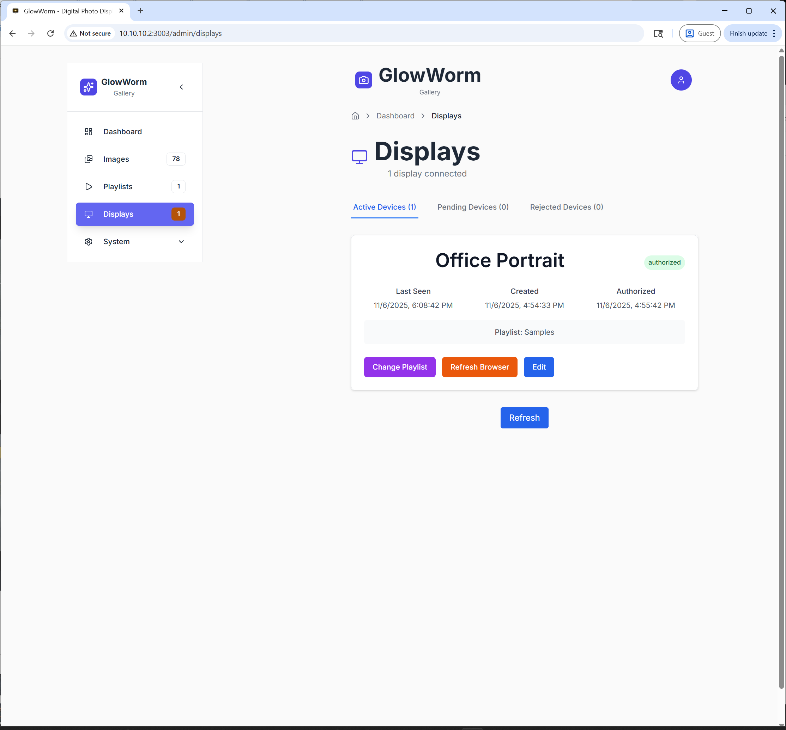

# GlowWorm

A modern web-based digital photo display system for creating beautiful fullscreen slideshows on portrait-oriented displays. Perfect for turning Raspberry Pi devices into stunning digital photo frames that showcase your memories with style.

GlowWorm transforms any display into an elegant photo frame with powerful features for managing, organizing, and presenting your photo collection. Built for home users, artists, businesses, and anyone wanting to display photos beautifully.

<p align="center">
  <a href="https://youtube.com/shorts/REHHyqISQyo">
    
  </a><br>
  [Youtube demo of display device playing a slideshow]
</p>

## Features

**Image Management**
- Upload and organize photos with automatic processing
- Create and manage albums with rename and delete options
- Bulk operations with multi-select (download, move, delete)
- Automatic thumbnail and variant generation
- EXIF data extraction and display
- Duplicate detection via perceptual hashing
- Support for JPEG, PNG, GIF, WebP, AVIF formats

**Playlist System**
- Create custom playlists from your image library
- Drag-and-drop reordering with visual pairing indicators
- Smart image pairing for landscape photos (automatic stacking)
- Multiple display modes optimized for different devices
- Per-playlist EXIF date display option
- Automatic variant generation for display resolutions

**Display Modes**
- Default - Smart pairing of landscape images with full-screen portraits
- Ken Burns Plus - Gentle zoom and pan effects (Raspberry Pi safe)
- Soft Glow - Subtle luminosity transitions
- Ambient Pulse - Breathing light effect
- Dreamy Reveal - Elegant fade-in animations
- Stacked Reveal - Synchronized dual-image transitions

**Display Device Management**
- Simple code-based device registration
- Multi-device support with individual configurations
- Real-time status monitoring and health checks
- Remote browser refresh and playlist assignment
- Automatic resolution detection with variant generation prompts
- Orientation-aware pairing (portrait vs landscape modes)

**Advanced Features**
- WebSocket-based real-time communication
- Resolution-optimized image variants
- Hardware acceleration support for Raspberry Pi
- Efficient preloading and caching
- RESTful API for programmatic access

**Modern Admin Interface**
- Clean, responsive design built with React and Tailwind CSS
- Mobile-optimized views and touch interactions
- Drag-and-drop image organization
- Live display status dashboard
- System logs and monitoring

## Screenshots

| Dashboard | Images |
|-----------|---------|
|  |  |

| Playlists | Displays |
|-----------|----------|
|  |  |

| Settings |
|----------|
|  |

### End to End Installation and Usage Example

[](https://www.youtube.com/watch?v=euAhnJv0RoE)

Watch the complete walkthrough: [GlowWorm Installation and Usage on YouTube](https://www.youtube.com/watch?v=euAhnJv0RoE)

---

## Compatibility

### Tested Environments

**Server Deployment (Docker):**
- Ubuntu Server 20.04+ - Fully tested and working
- Linux distributions with Docker support - Expected to work

**Display Devices:**
- Raspberry Pi with FullPageOS - Fully tested and working
- Firefox browser (desktop) - Fully tested and working
- Chrome browser (desktop) - Fully tested and working
- Chromium-based browsers - Expected to work
- WebKit-based browsers - Expected to work

### Untested Environments

**Server Deployment:**
- Windows (Docker Desktop) - May require adjustments
- macOS (Docker Desktop) - May require adjustments
- Non-Ubuntu Linux distributions - Should work but not verified

**Note on Windows/macOS:**
The Docker deployment is designed for Linux servers and may need modifications for Windows or macOS environments. Key areas that might need adjustment:
- File path handling in docker-compose.yml
- Network interface binding
- Volume mount permissions
- Script compatibility (quick-start.sh is bash-specific)

**Community Contributions Welcome:**
If you successfully deploy on Windows, macOS, or other platforms, please share your configuration via GitHub issues or pull requests. We will incorporate platform-specific instructions based on community testing.

---

## Quick Start

### Docker Deployment (Recommended)

**Requirements:**
- Docker Engine 20.10+
- Docker Compose 2.0+
- Linux server with 2GB+ RAM
- Port 3003 available

**Deploy in 2 commands:**

```bash
curl -O https://raw.githubusercontent.com/nstephens/glowworm/main/quick-start.sh
chmod +x quick-start.sh && ./quick-start.sh
```

The script will:
1. Download required Docker files
2. Generate secure passwords automatically
3. Detect your network interfaces
4. **Prompt you to edit the `.env` file** (configure network interface)
5. Start all services (frontend, backend, database)

**Interactive Configuration:**

The script pauses and prompts you to configure the network interface:

```bash
DISPLAY_NETWORK_INTERFACE=10.10.10.2  # Set to your server's IP
```

**Why this matters:**
- Controls which IP address Docker binds to for port 3003
- Required for display devices to connect from your network
- Prevents binding to localhost-only interfaces
- Ensures frontend is accessible across your network

The script will:
- Show your available network interfaces
- Open the `.env` file in your default editor
- Wait for you to save and close
- Validate the configuration
- Start the containers with correct settings

**Optional flags:**
- `--clean` - Delete existing data and .env for fresh install
- `--help` - Show all available options

**Access your installation:**
- Open browser: `http://YOUR_SERVER_IP:3003` (use the IP you configured)
- Complete the setup wizard (set admin password)
- Start uploading photos

**Docker Hub Images:**
- [Backend](https://hub.docker.com/r/nickstephens/glowworm-backend)
- [Frontend](https://hub.docker.com/r/nickstephens/glowworm-frontend)

---

## Configuration

### First-Time Setup Wizard

On first access, the setup wizard guides you through:
1. **Admin Password** - Set your admin account password
2. **Done** - Docker handles database configuration automatically

For native installations, the wizard also configures:
- MySQL database connection
- Network interfaces
- Server ports

### System Settings

Access `/admin/system/` to configure:

**General**
- Server URLs and base configuration
- Default display timing
- Network interface settings

**Users**
- User management and permissions
- Password reset
- Access control

**Database**
- MySQL connection settings (native installs)
- Backup and maintenance

**OAuth**
- Google OAuth integration (optional)
- Client ID and secret configuration

**Displays**
- Target display resolutions
- Custom resolution variants
- Automatic variant generation

**Utilities**
- Image debugging mode toggle
- Variant generation jobs
- Background tasks

### Environment Variables (Docker)

The `.env` file controls Docker deployment:

```bash
# Database (auto-configured by quick-start.sh)
MYSQL_ROOT_PASSWORD=<auto-generated>
MYSQL_PASSWORD=<auto-generated>
MYSQL_DATABASE=glowworm

# Application
SECRET_KEY=<auto-generated>
SERVER_BASE_URL=http://YOUR_SERVER_IP:8001
DEFAULT_DISPLAY_TIME_SECONDS=30

# Network Configuration (REQUIRED)
DISPLAY_NETWORK_INTERFACE=10.10.10.2  # Your server's IP address

# Ports
FRONTEND_PORT=3003
BACKEND_PORT=8001
```

**Important:** You must set `DISPLAY_NETWORK_INTERFACE` to your server's IP address for Docker to bind ports correctly. Use `ip addr show` to find your interface IP.

Generate secure passwords: `openssl rand -base64 32`

---

## Usage Instructions

### For Administrators

**1. Upload and Organize Images**
- Navigate to `/admin/images`
- Drag and drop photos or click "Upload Images"
- Create albums to organize your collection
- Rename or delete albums as needed
- Use checkboxes to select multiple images
- Bulk download images as zip files
- Move images between albums

**2. Create and Manage Playlists**
- Navigate to `/admin/playlists`
- Click "Create Playlist"
- Automatically redirected to add images
- Select images from your albums
- Drag to reorder with visual pairing indicators
- Configure display timing and mode
- Enable EXIF date display (shows capture date)
- Colored borders show paired landscape images

**3. Set Up Display Devices**
- Navigate to `/admin/displays`
- Display device shows registration code
- Authorize device and assign friendly name
- Assign playlist to device
- System prompts for variant generation if needed
- Monitor device status and last seen time

**4. Remote Control and Monitoring**
- View live display status on dashboard
- Refresh display browsers remotely
- Change playlists on the fly
- Monitor device health and connectivity
- Export display logs for troubleshooting

### For Display Devices

**Connect a Display Device:**
1. Open browser on display device (e.g., Raspberry Pi)
2. Navigate to `http://YOUR_SERVER_IP:3003/display`
3. Registration code appears automatically
4. Admin authorizes from `/admin/displays`
5. Slideshow starts automatically
6. Display updates in real-time via WebSocket

**Display Behavior:**
- **Smart Pairing** - Consecutive landscape images display as stacked pairs
- **Adaptive Layout** - Portrait images show full-screen
- **Smooth Transitions** - Hardware-accelerated animations
- **Auto-Reconnection** - Recovers from network interruptions
- **Resolution Matching** - Automatically uses optimized image variants

---

## Raspberry Pi Display Setup

GlowWorm works great with Raspberry Pi running FullPageOS or Raspberry Pi OS with Chromium in kiosk mode.

### Recommended: FullPageOS

**1. Install FullPageOS**
- Use Raspberry Pi Imager
- Select FullPageOS from "Other specific-purpose OS"
- Flash to SD card

**2. Configure FullPageOS**

Edit `fullpageos-wpa-supplicant.txt` for WiFi:
```bash
network={
  ssid="YourNetworkName"
  psk="YourPassword"
}
```

Edit `fullpageos.txt` to set URL:
```bash
export FULLPAGEOS_URL=http://YOUR_SERVER_IP:3003/display
```

**3. Optimize Chromium Flags**

```bash
sudo vi /home/pi/scripts/start_chromium_browser

flags=(
  --kiosk
  --touch-events=enabled
  --disable-pinch
  --noerrdialogs
  --disable-session-crashed-bubble
  --autoplay-policy=no-user-gesture-required
  --use-gl=egl
  --enable-gpu-rasterization
  --enable-accelerated-video-decode
  --enable-gpu-compositing
  --enable-oop-rasterization
  --memory-pressure-off
)
```

### Display Resolution

For best performance on Pi 4/5, use 1080p instead of 4K:

```bash
sudo vi /etc/X11/xorg.conf.d/20-raspi.conf

Section "Screen"
  Identifier "Screen"
  Device "Raspberry Pi GPU"
  DefaultDepth 24
  SubSection "Display"
    Depth 24
    Modes "1920x1080"
  EndSubSection
EndSection
```

### Performance Tuning

```bash
sudo vi /boot/firmware/config.txt

[all]
gpu_mem=128
dtoverlay=vc4-kms-v3d-pi5
arm_freq=2400
gpu_freq=800
```

Disable unused services:
```bash
sudo systemctl disable bluetooth wifi-powersave ModemManager
```

---

## Production Setup with Custom Domain

For production use, we recommend using a reverse proxy to get:
- Custom domain (e.g., `photos.yourdomain.com`)
- SSL/HTTPS encryption
- Clean URLs (no port numbers)

### Using Nginx Proxy Manager (Recommended)

**1. Connect NPM to Glowworm's network:**

```bash
# Find your Nginx Proxy Manager container
docker ps | grep nginx

# Connect it to Glowworm
docker network connect glowworm_glowworm-network <npm-container-name>
```

**2. Create Proxy Host in NPM UI:**
- **Domain Names:** `your-domain.com`
- **Scheme:** `http`
- **Forward Hostname/IP:** `glowworm-frontend`
- **Forward Port:** `3003`
- **SSL:** Enable and force SSL as desired

**3. Add to "Advanced" tab:**

```nginx
# Let Vite frontend handle all API proxying internally
location / {
    proxy_pass http://glowworm-frontend:3003;
    proxy_set_header Host $host;
    proxy_set_header X-Real-IP $remote_addr;
    proxy_set_header X-Forwarded-For $proxy_add_x_forwarded_for;
    proxy_set_header X-Forwarded-Proto $scheme;
    
    # WebSocket support for real-time features
    proxy_http_version 1.1;
    proxy_set_header Upgrade $http_upgrade;
    proxy_set_header Connection "upgrade";
}
```

**That's it!** Access your installation at `https://your-domain.com`

### Using Native Nginx

If running Nginx directly on your server (not in Docker):

```nginx
server {
    listen 80;
    server_name your-domain.com;
    
    location / {
        proxy_pass http://localhost:3003;
        proxy_set_header Host $host;
        proxy_set_header X-Real-IP $remote_addr;
        proxy_set_header X-Forwarded-For $proxy_add_x_forwarded_for;
        proxy_set_header X-Forwarded-Proto $scheme;
        
        # WebSocket support
        proxy_http_version 1.1;
        proxy_set_header Upgrade $http_upgrade;
        proxy_set_header Connection "upgrade";
    }
}
```

### Other Reverse Proxies (Traefik, Caddy, etc.)

Simply point your reverse proxy to:
- **Target:** Frontend service (port 3003 or `glowworm-frontend` container)
- **WebSocket:** Enable WebSocket support for real-time features

The frontend automatically handles all API and WebSocket routing internally.

**Architecture Note:**
- Only expose the **frontend** (port 3003)
- Backend (port 8001) stays internal to Docker network for security
- Frontend's Vite proxy handles `/api/*` and `/ws/*` routing
- No CORS or mixed content issues

---

## Advanced Installation

### Manual Docker Setup

```bash
# Create directory and download files
mkdir glowworm && cd glowworm
curl -O https://raw.githubusercontent.com/nstephens/glowworm/main/docker-compose.yml
mkdir -p docker/{mysql,scripts}
curl -o docker/env.example https://raw.githubusercontent.com/nstephens/glowworm/main/docker/env.example
curl -o docker/mysql/init.sql https://raw.githubusercontent.com/nstephens/glowworm/main/docker/mysql/init.sql
curl -o docker/scripts/wait-for-mysql.sh https://raw.githubusercontent.com/nstephens/glowworm/main/docker/scripts/wait-for-mysql.sh
curl -o docker/scripts/start-backend.sh https://raw.githubusercontent.com/nstephens/glowworm/main/docker/scripts/start-backend.sh
chmod +x docker/scripts/*.sh

# Configure environment
cp docker/env.example .env
nano .env  # Set secure passwords and SERVER_BASE_URL

# Launch
docker compose up -d
```

### Native Installation (Without Docker)

**Prerequisites:**
- Python 3.8+, Node.js 20+, MySQL 8.0+

**Setup:**

```bash
# Clone repository
git clone https://github.com/nstephens/glowworm.git
cd glowworm

# Run setup script (recommended)
./setup.sh

# Or manually:
# Backend
cd backend
python -m venv venv
source venv/bin/activate
pip install -r requirements.txt

# Frontend
cd ../frontend
npm install

# Start services
cd ..
./start_glowworm.sh
```

**Access:** `http://localhost:3003` and complete setup wizard

---

## Project Structure

```
glowworm/
├── backend/                 # Python FastAPI application
│   ├── api/                # REST API endpoints
│   ├── models/             # Database models (SQLAlchemy)
│   ├── services/           # Business logic
│   ├── websocket/          # WebSocket handlers
│   ├── utils/              # Helper functions
│   ├── alembic/            # Database migrations
│   └── config/             # Settings management
├── frontend/               # React TypeScript app
│   ├── src/
│   │   ├── components/     # Reusable UI components
│   │   ├── pages/          # Route pages
│   │   ├── services/       # API integration
│   │   ├── hooks/          # Custom React hooks
│   │   └── contexts/       # State management
├── docker/                 # Docker configuration
│   ├── mysql/             # Database initialization
│   └── scripts/           # Container startup scripts
└── data/                   # Persistent data (bind mounts)
    ├── mysql/             # Database files
    └── uploads/           # Image storage
        ├── thumbnails/    # Generated thumbnails
        ├── originals/     # Original uploaded images
        └── scaled/        # Resolution-optimized variants
```

---

## Technology Stack

**Backend:**
- Python FastAPI with SQLAlchemy ORM
- MySQL 8.0+ database
- WebSocket for real-time communication
- Pillow for image processing
- Alembic for database migrations

**Frontend:**
- React with TypeScript
- Tailwind CSS with shadcn/ui components
- Vite dev server with API proxy
- Axios for API calls
- React DnD for drag-and-drop

**Deployment:**
- Docker Compose multi-container setup
- Optimized for Raspberry Pi displays
- Works on any Linux server

---

## Image Processing

### Automatic Processing

When images are uploaded:
- Thumbnails generated automatically (small, medium, large sizes)
- EXIF data extracted and stored
- Smart storage hierarchy organized by upload date
- Duplicate detection via perceptual hash
- Dominant color extraction for UI theming

### Resolution Variants

Automatically generates optimized variants for configured display sizes:
- Pre-scaled images for faster loading
- Resolution matching for display devices
- Quality optimization based on target device
- Background processing without blocking UI

### Supported Formats

- JPEG (including progressive)
- PNG (with transparency)
- GIF (static, animated not supported)
- WebP
- AVIF
- MPO (treated as JPEG)

---

## Display Features

### Smart Image Pairing

The system automatically pairs consecutive landscape images for optimal display:
- Analyzes image dimensions and orientation
- Creates stacked layouts (top/bottom) for landscape pairs
- Full-screen display for portrait images
- Visual pairing indicators in admin interface (colored borders)
- Maintains pairing across display modes

### Display Modes Explained

**Default Mode**
- Automatic pairing of landscape images
- Full-screen portraits
- Clean, simple transitions
- Raspberry Pi safe (30fps)

**Ken Burns Plus**
- Gentle zoom and pan effects
- Breathing transitions (slower exhale)
- Hardware-optimized for Raspberry Pi
- Adds cinematic movement to static images

**Soft Glow**
- Subtle luminosity transitions
- Elegant fade effects
- Low resource usage
- Perfect for ambient displays

**Ambient Pulse**
- Breathing light effect
- Gentle opacity variations
- Calming, meditative presentation
- Minimal processing requirements

**Dreamy Reveal**
- Progressive blur-to-sharp transitions
- Elegant entrance animations
- Moderate performance requirements
- Beautiful for high-end displays

**Stacked Reveal**
- Synchronized transitions for paired images
- Directional slide effects
- Maintains visual connection between pairs
- Best for landscape-heavy collections

### EXIF Date Display

Per-playlist option to show photo capture dates:
- Formatted as "Sunday February 21, 2022"
- Subtle overlay with low opacity
- Positioned strategically (lower right for single, diagonal for pairs)
- Only shows if EXIF data available
- Helpful for chronological family photo displays

### Image Debugging Mode

Global system setting for troubleshooting:
- Toggle in `/admin/system/utilities`
- Shows filename, resolution, and date overlays
- Applies to all playlists when enabled
- Useful for verifying correct images are displayed
- Higher opacity overlay for easy reading

---

## Display Device Setup

### Automatic Registration Flow

**From Display Device:**
1. Navigate to `http://YOUR_SERVER_IP:3003/display`
2. System generates unique registration code
3. QR code displayed for easy mobile scanning
4. Device waits for authorization

**From Admin Interface:**
1. Navigate to `/admin/displays`
2. Pending device appears automatically
3. Click "Authorize"
4. Optionally set friendly name and identifier
5. System detects resolution and suggests variant generation
6. Assign playlist
7. Display starts slideshow immediately

### Resolution Detection

The system automatically:
- Detects display resolution and pixel ratio
- Determines orientation (portrait/landscape)
- Prompts for variant generation if resolution is standard (2K, 4K, etc.)
- Matches best available image variant for device
- Falls back to original if no variant available

### Device Management

**Active Devices:**
- Change assigned playlist
- Refresh browser remotely
- Edit device name and identifier
- Monitor last seen timestamp
- View connection health

**Pending Devices:**
- Authorize new devices
- Reject unauthorized devices
- View device specifications before authorizing

**Rejected Devices:**
- Edit device information
- Delete permanently
- Bulk delete multiple rejected devices

---

## Security

**Authentication**
- Cookie-based sessions with secure HttpOnly flags
- Bcrypt password hashing with SHA-256 pre-hashing
- Session timeout and refresh handling
- Secure token generation for display devices

**Authorization**
- Role-based access control (Super Admin, Admin, User)
- Device authorization required before display access
- Per-user permissions management

**Protection**
- CSRF protection on all form submissions
- Input validation beyond file extensions
- SQL injection prevention via SQLAlchemy ORM
- XSS protection with template escaping and CSP headers
- Device token invalidation on rejection

**Best Practices**
- Use strong passwords (generated automatically by quick-start script)
- Run behind reverse proxy with SSL in production
- Regularly update Docker images
- Monitor device authorization requests
- Keep display devices on trusted networks

---

## Troubleshooting

### Images Not Loading
- Check Docker logs: `docker compose logs glowworm-backend`
- Verify data directory permissions: `sudo chown -R 1000:1000 data/uploads`
- Ensure reverse proxy configured correctly
- Check backend health: `docker compose ps`

### Can't Access via Custom Domain
- Verify reverse proxy on same Docker network
- Check Nginx config points to `glowworm-frontend:3003`
- Enable WebSocket support in proxy config
- Verify DNS records are correct

### Display Device Won't Connect
- Ensure display can reach server IP (ping test)
- Check firewall allows port 3003
- Verify device is authorized in `/admin/displays`
- Check browser console for errors on display

### Setup Wizard Keeps Appearing
- System uses localStorage to track setup completion
- Temporary connection errors won't trigger setup redirect
- Check `.env` file has passwords set
- Verify backend is healthy: `docker compose ps`
- Check backend logs: `docker compose logs glowworm-backend`

### Database Connection Errors
- Reset database: `docker compose down && sudo rm -rf data/mysql && docker compose up -d`
- Or use quick-start script: `./quick-start.sh --clean`
- Check MySQL credentials in `.env` match
- Wait for MySQL to fully start (health check passes)

### Variant Generation Issues
- CPU spike during generation is normal
- Process runs in background, UI remains responsive
- Check progress in backend logs
- Can always regenerate from `/admin/system/utilities`
- Large libraries may take several minutes

### Performance Issues on Raspberry Pi
- Reduce display resolution to 1080p
- Use Tier 1 display modes (Ken Burns Plus, Soft Glow, Ambient Pulse)
- Ensure hardware acceleration enabled
- Verify GPU memory allocated (`gpu_mem=128`)
- Disable unused system services

**Full troubleshooting guide:** See [DOCKER_SETUP.md](DOCKER_SETUP.md)

---

## API Access

### Endpoints

**Images**
- `GET /api/images` - List all images
- `POST /api/images/upload` - Upload new images
- `PUT /api/images/{id}` - Update image metadata
- `DELETE /api/images/{id}` - Delete image
- `POST /api/images/download-zip` - Bulk download as zip
- `POST /api/images/regenerate-resolutions` - Generate variants

**Playlists**
- `GET /api/playlists` - List all playlists
- `POST /api/playlists` - Create new playlist
- `PUT /api/playlists/{id}` - Update playlist
- `DELETE /api/playlists/{id}` - Delete playlist
- `GET /api/playlists/{id}/smart` - Get resolution-optimized playlist
- `PUT /api/playlists/{id}/reorder` - Reorder images

**Display Devices**
- `GET /api/display-devices` - List all devices
- `POST /api/display-devices/register` - Register new device
- `PUT /api/display-devices/{id}/authorize` - Authorize device
- `POST /api/display-devices/{id}/refresh` - Refresh browser
- `DELETE /api/display-devices/{id}` - Delete device

**System**
- `GET /api/settings` - Get system settings
- `PUT /api/settings` - Update system settings
- `GET /api/setup/status` - Check setup status
- `GET /api/setup/version` - Get installed version

**Authentication**
- All endpoints require authentication via session cookie
- Display endpoints use device token authentication
- CSRF protection on state-changing operations

---

## Contributing

We welcome contributions!

**Development Setup:**
1. Fork the repository
2. Create a feature branch (`git checkout -b feature/amazing-feature`)
3. Make your changes
4. Test thoroughly (especially Docker deployment)
5. Commit with descriptive messages
6. Push to your fork
7. Open a Pull Request

**Coding Standards:**
- Backend: Follow PEP 8 for Python code
- Frontend: Use TypeScript strict mode
- Use existing component patterns
- Add comments for complex logic
- Update documentation for new features

**Testing:**
- Test Docker builds before committing
- Verify migrations are idempotent
- Test on both desktop and mobile
- Check Raspberry Pi compatibility for display features

---

## Additional Documentation

- **[DOCKER_SETUP.md](DOCKER_SETUP.md)** - Comprehensive Docker deployment guide
- **Project Structure** - Detailed code organization
- **API Documentation** - Backend API reference
- **Development Guide** - Local development setup

---

## License

This project is licensed under the GNU General Public License v3.0 - see the LICENSE file for details.

---

## Support

- **Issues:** Use the [GitHub issue tracker](https://github.com/nstephens/glowworm/issues)
- **Questions:** Check existing issues or open a new one
- **Documentation:** See [DOCKER_SETUP.md](DOCKER_SETUP.md) for detailed guides

---

## Use Cases

**Home Photo Displays**
- Turn old monitors into beautiful digital photo frames
- Display family memories with EXIF dates
- Organize by events, people, or time periods

**Art Galleries**
- Display rotating art collections
- Multiple playlists for different exhibitions
- Real-time updates during events

**Business Displays**
- Show product photos, menus, or promotional content
- Multiple displays with different content
- Easy content updates via web interface

**Event Displays**
- Weddings, parties, conferences
- Guest photo submissions via album sharing
- Live playlist updates during events

**Museum Exhibits**
- Curated image collections with metadata
- Easy updates without technical knowledge
- Professional display modes

---

## Advanced Topics

### WebSocket Features

**Real-Time Communication:**
- Live display control and monitoring
- Instant playlist updates across all devices
- Device status heartbeat monitoring
- Automatic reconnection handling
- Broadcast updates to connected displays

**Technical Details:**
- WebSocket endpoint: `/ws/display/{device_token}`
- Admin WebSocket: `/ws/admin`
- Heartbeat interval: 30 seconds
- Automatic reconnection with exponential backoff

### System Architecture

**Three-Tier Design:**
- **Frontend** (port 3003) - Single entry point for all requests
- **Backend** (port 8001) - Internal API server (not exposed)
- **Database** (MySQL) - Internal only (no external access)

**Request Flow:**
1. Client → Frontend (port 3003)
2. Frontend proxy → Backend (internal port 8001)
3. Backend → Database (internal port 3306)
4. Response flows back through chain

**Why this architecture?**
- Single port exposure (simpler firewall rules)
- No CORS issues (single origin)
- No mixed content errors (HTTPS works seamlessly)
- Better security (backend not directly accessible)
- Works with any reverse proxy setup

### Database Migrations

**Automatic migrations:**
- Alembic handles all schema changes
- Migrations run automatically on backend startup
- Idempotent design allows safe re-runs
- Supports both fresh installs and upgrades

**Manual migration control:**
```bash
# Inside backend container
docker compose exec glowworm-backend-dev /bin/bash
cd backend
python -m alembic upgrade head
```

---

**Built for digital photo enthusiasts**
