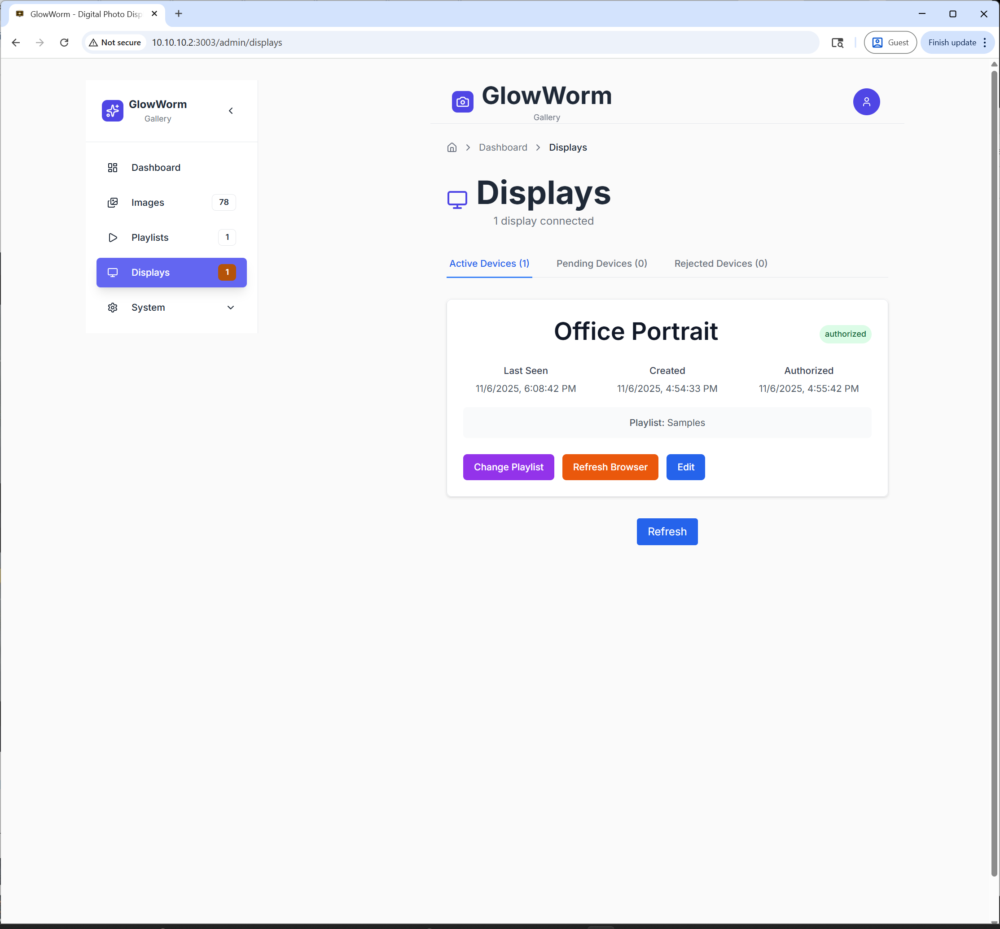

# GlowWorm

A modern digital photo display system for creating beautiful fullscreen slideshows on Raspberry Pi devices. Version 3.0 features GPU-accelerated rendering via Pi3D for smooth, reliable performance.

GlowWorm transforms any display into an elegant photo frame with powerful features for managing, organizing, and presenting your photo collection. Built for home users, artists, businesses, and anyone wanting to display photos beautifully.

<p align="center">
  <a href="https://youtube.com/shorts/REHHyqISQyo">
    
  </a><br>
  [Youtube demo of display device playing a slideshow]
</p>

## What's New in v3.0

- **GPU-accelerated display** - Smooth 30+ FPS transitions using Pi3D (OpenGL ES)
- **Lower memory usage** - Under 200MB RAM vs 400MB+ with browser-based display
- **Improved reliability** - No more browser crashes or memory leaks
- **Simplified setup** - Standard Raspberry Pi OS Lite (no FullPageOS required)
- **Offline operation** - Continues displaying cached images indefinitely without network

## Screenshots

| Dashboard | Images |
|-----------|---------|
|  |  |

| Playlists | Displays |
|-----------|----------|
|  |  |

| Settings |
|----------|
|  |

### End to End Installation and Usage Example

[](https://www.youtube.com/watch?v=euAhnJv0RoE)

Watch the complete walkthrough: [GlowWorm Installation and Usage on YouTube](https://www.youtube.com/watch?v=euAhnJv0RoE)

## Features

**Image Management**
- Upload and organize photos with automatic processing
- Create and manage albums with rename and delete options
- Bulk operations with multi-select (download, move, delete)
- Automatic thumbnail and variant generation
- EXIF data extraction and display
- Duplicate detection via perceptual hashing
- Support for JPEG, PNG, GIF, WebP, AVIF formats

**Playlist System**
- Create custom playlists from your image library
- Drag-and-drop reordering with visual pairing indicators
- Smart image pairing for landscape photos (automatic stacking)
- Per-playlist EXIF date display option
- Automatic variant generation for display resolutions

**Scheduling System**
- Time-based playlist switching
- Day-of-week scheduling for different content
- Automatic power on/off for display devices via HDMI-CEC
- Perfect for businesses or themed displays
- Set-and-forget automation

**Pi3D Display Engine (v3.0)**
- GPU-accelerated OpenGL ES 2.0 rendering
- Smooth cross-fade transitions at 30+ FPS
- Local image caching with LRU eviction
- Automatic crash recovery and restart
- Registration code display for easy device setup

**Display Device Management**
- Simple code-based device registration
- Multi-device support with individual configurations
- Real-time status monitoring via WebSocket
- Remote control (next, previous, pause, resume)
- Cache statistics and health monitoring

**Advanced Features**
- WebSocket-based real-time communication
- Resolution-optimized image variants
- Efficient preloading and caching
- RESTful API for programmatic access

**Modern Admin Interface**
- Clean, responsive design built with React and Tailwind CSS
- Mobile-optimized views and touch interactions
- Drag-and-drop image organization
- Live display status dashboard
- System logs and monitoring

## Compatibility

### Server Deployment (Docker)

- Ubuntu Server 20.04+ - Fully tested and working
- Linux distributions with Docker support - Expected to work

### Display Devices

- **Raspberry Pi 4 (4GB+)** - Recommended, fully tested
- **Raspberry Pi 5** - Fully supported
- **Raspberry Pi 3B+** - Supported (may have lower FPS during transitions)

### Requirements

- Raspberry Pi OS Lite (64-bit, Bookworm or newer)
- Python 3.11+
- HDMI display (any resolution, 1080p recommended)

---

## Quick Start

### 1. Deploy the Server (Docker)

**Requirements:**
- Docker Engine 20.10+
- Docker Compose 2.0+
- Linux server with 2GB+ RAM
- Port 3003 available

**Deploy in 2 commands:**

```bash
curl -O https://raw.githubusercontent.com/nstephens/glowworm/main/quick-start.sh
chmod +x quick-start.sh && ./quick-start.sh
```

The script will:
1. Download required Docker files
2. Generate secure passwords automatically
3. Detect your network interfaces
4. Prompt you to configure the network interface in `.env`
5. Start all services (frontend, backend, database)

**Access your installation:**
- Open browser: `http://YOUR_SERVER_IP:3003`
- Complete the setup wizard (set admin password)
- Start uploading photos

### 2. Set Up a Display Device

On your Raspberry Pi (running Raspberry Pi OS Lite 64-bit):

```bash
curl -sSL https://raw.githubusercontent.com/nstephens/glowworm/main/pi3d/scripts/install.sh | sudo bash
```

The installer will:
1. Install Pi3D and dependencies
2. Set up the GlowWorm daemon
3. Run the configuration wizard
4. Start the service

When complete, a registration code will appear on screen. Enter this code in your GlowWorm admin interface to authorize the device.

**Docker Hub Images:**
- [Backend](https://hub.docker.com/r/nickstephens/glowworm-backend)
- [Frontend](https://hub.docker.com/r/nickstephens/glowworm-frontend)

---

## Documentation

### Pi3D Display (v3.0)

- [Installation Guide](docs/pi3d/installation.md) - Complete setup instructions
- [Configuration Reference](docs/pi3d/configuration.md) - All configuration options
- [Troubleshooting](docs/pi3d/troubleshooting.md) - Common issues and solutions
- [Developer Documentation](docs/pi3d/development.md) - Architecture and IPC protocol

### General Documentation

Visit the **[GlowWorm Wiki](https://github.com/nstephens/glowworm/wiki)** for:

**Getting Started**
- [Server Installation](https://github.com/nstephens/glowworm/wiki/Installation)
- [Configuration](https://github.com/nstephens/glowworm/wiki/Configuration)
- [First-Time Setup](https://github.com/nstephens/glowworm/wiki/Setup-Wizard)

**Usage**
- [Admin Interface Guide](https://github.com/nstephens/glowworm/wiki/Admin-Interface)
- [Creating Playlists](https://github.com/nstephens/glowworm/wiki/Playlists)
- [Managing Display Devices](https://github.com/nstephens/glowworm/wiki/Display-Devices)
- [Scheduling System](https://github.com/nstephens/glowworm/wiki/Scheduling)

**Advanced**
- [Reverse Proxy Setup](https://github.com/nstephens/glowworm/wiki/Reverse-Proxy)
- [Custom Domain Configuration](https://github.com/nstephens/glowworm/wiki/Custom-Domain)
- [API Documentation](https://github.com/nstephens/glowworm/wiki/API)

**Troubleshooting**
- [Common Issues](https://github.com/nstephens/glowworm/wiki/Troubleshooting)
- [Docker Issues](https://github.com/nstephens/glowworm/wiki/Docker-Troubleshooting)

---

## Architecture

```
┌─────────────────────────────────────────────────────────────┐
│                    GlowWorm Server (Docker)                  │
│  ┌─────────────┐  ┌─────────────┐  ┌───────────────────┐    │
│  │   FastAPI   │  │   Celery    │  │      MySQL        │    │
│  │   Backend   │  │   Workers   │  │     Database      │    │
│  └──────┬──────┘  └─────────────┘  └───────────────────┘    │
│         │                                                    │
│  ┌──────┴──────────────────────────────────────────────┐    │
│  │               WebSocket Manager                      │    │
│  └──────────────────────┬──────────────────────────────┘    │
└─────────────────────────┼───────────────────────────────────┘
                          │
         ┌────────────────┴────────────────┐
         │                                 │
         ▼                                 ▼
┌─────────────────────┐         ┌─────────────────────────────┐
│   Admin Interface   │         │     Raspberry Pi Display    │
│   (React Frontend)  │         │                             │
│                     │         │  ┌───────────────────────┐  │
│  - Image upload     │         │  │   GlowWorm Daemon     │  │
│  - Playlist editing │         │  │   - WebSocket client  │  │
│  - Device control   │         │  │   - Image caching     │  │
│  - Scheduling       │         │  │   - Playlist state    │  │
└─────────────────────┘         │  └───────────┬───────────┘  │
                                │              │ IPC          │
                                │  ┌───────────▼───────────┐  │
                                │  │   Pi3D Display        │  │
                                │  │   - GPU rendering     │  │
                                │  │   - 30+ FPS           │  │
                                │  │   - <200MB RAM        │  │
                                │  └───────────────────────┘  │
                                └─────────────────────────────┘
```

---

## Contributing

We welcome contributions! Please see the [Contributing Guide](https://github.com/nstephens/glowworm/wiki/Contributing) in the wiki for:
- Development setup instructions
- Coding standards
- Testing guidelines
- Pull request process

---

## License

This project is licensed under the GNU General Public License v3.0 - see the LICENSE file for details.

---

## Support

- **Documentation:** [GlowWorm Wiki](https://github.com/nstephens/glowworm/wiki) and [Pi3D Docs](docs/pi3d/)
- **Issues:** [GitHub Issue Tracker](https://github.com/nstephens/glowworm/issues)
- **Questions:** Check existing issues or open a new one

---

**Built for digital photo enthusiasts**
